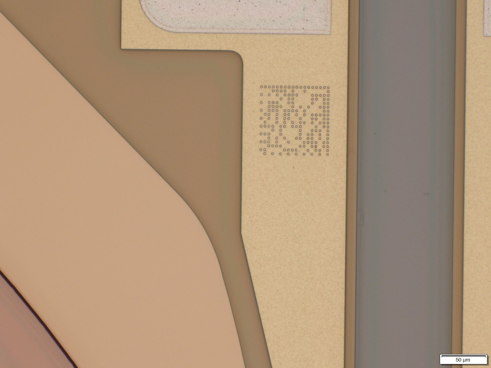
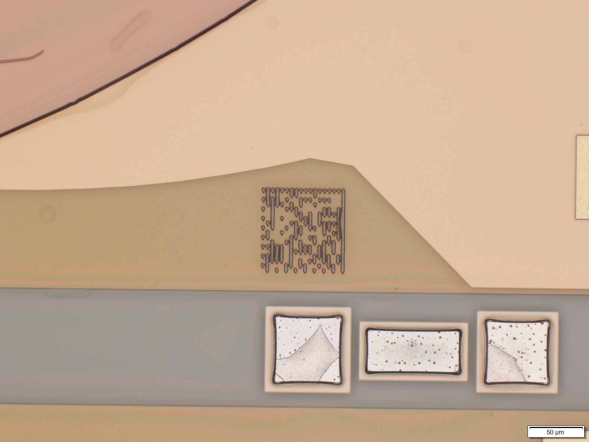
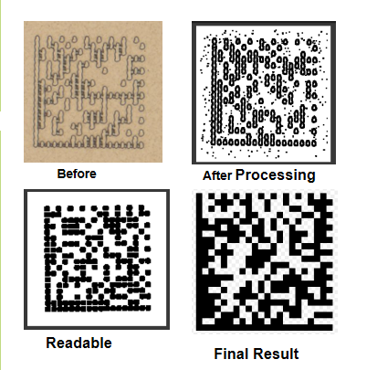
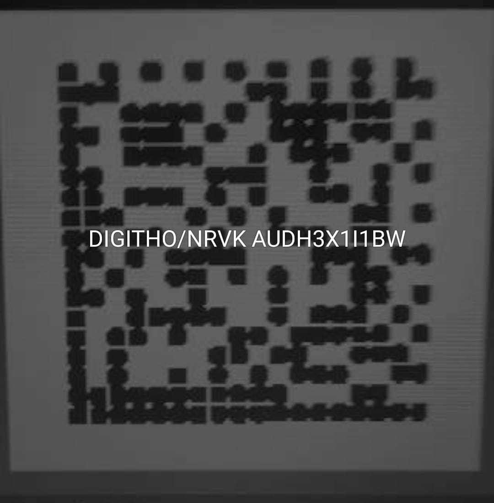
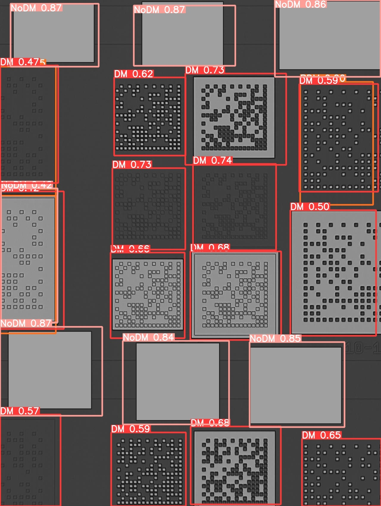

# Semiconductor DataMatrix Prediction and Reconstruction

This project focuses on reconstructing and detecting Data Matrix codes 
engraved on semiconductor surfaces. It involves preprocessing distorted 
images using image processing techniques and training a custom object detection model 
using Roboflow for automated detection.

---

## Overview

Many semiconductor images contain degraded or visually corrupted DataMatrix (DM) codes. 
These codes are reconstructed using classical image processing techniques. 
Once reconstructed, a YOLO model was trained to perform robust detection on a diverse 
set of noisy, colored, and blurred DM samples.

---

## Project Structure

```
├── main.py                        # Entry point to run the full pipeline (reconstruction + detection setup)
├── requirements.txt              # Python dependencies required to run the project
├── revertImages.py               # Script to reverse image distortions based on given pattern
├── scripts/                      # Helper scripts for encoding DataMatrix and other related operations
├── config/                       # Configuration files (e.g., constants, paths, pattern settings)
├── image-utils/                  # Utility functions for image pre-processing and transformations
├── docs-and-images/
│   ├── images/                   # Sample images showing distortions, reconstructions, detection results
│   ├── DM Coordinates.docx       # Document explaining challenges, image conditions, and coordinate notes
│   ├── patterns.txt              # Describes the four distortion patterns handled in the dataset
│   └── AnnotationsVott.json      # Roboflow-compatible annotations used for YOLO object detection
```

---

## How to Use

### 🔧 Reconstructing DM Images

Use the `revertImages.py` script to process a directory of distorted DM images based on one of the four known distortion patterns.

```bash
python revertImages.py "D:\Path-to-Image-Directory" "pattern-name"
```

## YOLO Object Detection
The YOLOv8 object detection model was trained using images reconstructed by this project.

You can view and test the model on Roboflow:

👉 [View Project on Roboflow](https://app.roboflow.com/dmdetection-ar4dk/dm-detection/models)

The model was trained with noise-augmented and varied-quality images to improve detection
robustness.

## Below are the processing and detection results.

These images reflect the results after applying image processing techniques and 
YOLO-based object detection.

#### Original 
<p align="center"> 
 
 
</p>

#### Result

<p align="center"> 

</p>

### Extracted

<p align="center">
 
</p>

#### Detedted
<p align="center">

</p>

## Additional Resources

- ```DM Coordinates.docx``` – Contains descriptions of image challenges and coordinate information.

- ```patterns.txt``` – Lists the four known distortion patterns and their handling strategies.

- ```AnnotationsVott.json``` – Roboflow annotations for training.


## Tech Stack
- Python (OpenCV, NumPy, etc.)

- Roboflow (YOLOv8 Detection)

- Manual image pattern reconstruction using custom scripts

---

### Notes:
- Replace the `Roboflow` link if you want the exact model/project page.
- Make sure images exist at those paths. If structure changes, update paths accordingly.
- You can add a `.gif` or small screen recording to show reconstruction if needed.

Would you like me to generate a preview `.md` file or help auto-format the image grid better?