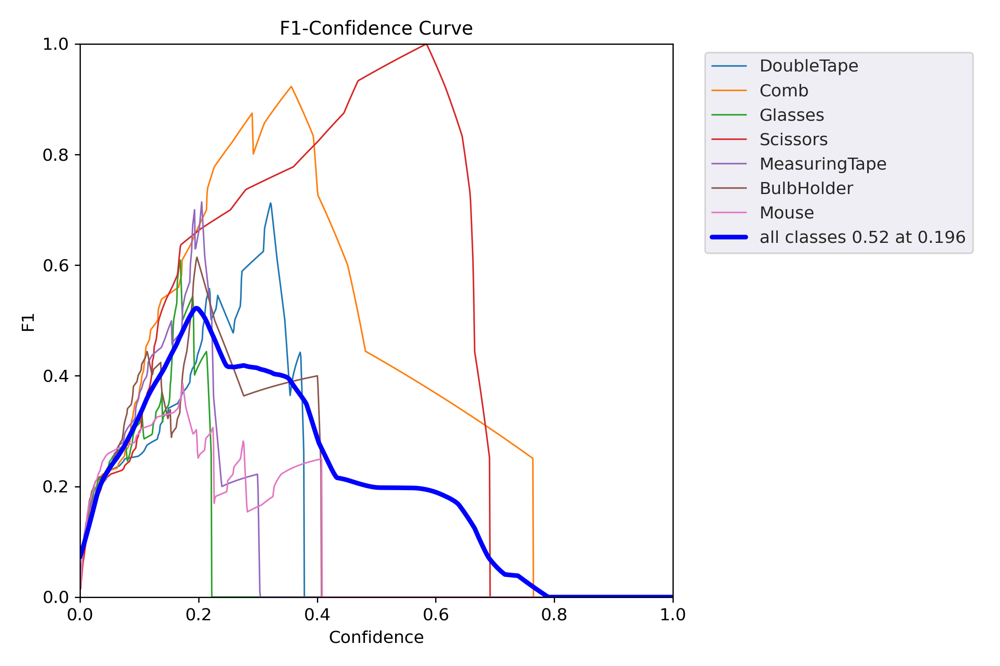
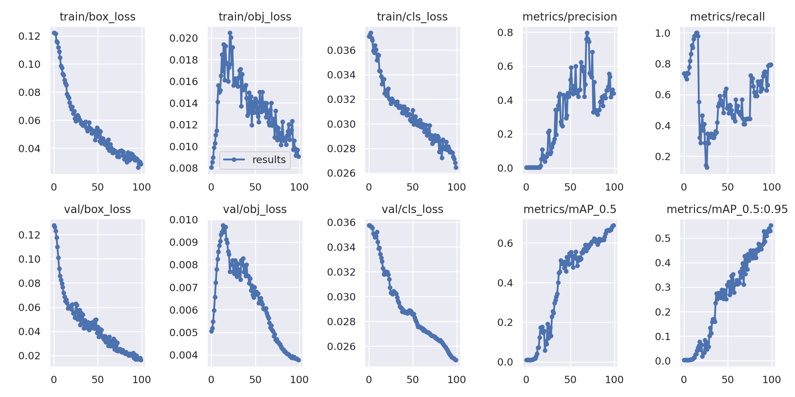

## Table Items Object Detection with YOLOv5
This project demonstrates object detection on household tabletop items using YOLOv5, 
trained locally on custom images. 

The dataset includes everyday objects like ```scissors, 
double tape, glasses, measuring tape, comb, mouse, and more```
captured via a mobile phone in natural indoor lighting.

Despite being a small-scale toy project, it showcases the complete object detection 

workflow: data collection, annotation, training, and evaluation using modern CV tools

## Project Structure
```
├── data/
│   ├── images/              # Annotated training images
│   └── labels/              # YOLO-format annotation files
├── random-test-images/      # Unseen images for testing model generalization
├── results/                 # Saved evaluation plots & prediction results
│   ├── PR_curve.png
│   ├── F1_curve.png
│   ├── P_curve.png
│   ├── R_curve.png
│   └── results.png
├── training_notebook.ipynb  # YOLOv5 training script
```

## Results

### Predictions

<p align="center"> 

 

</p>

#### Precision-Recall & F1 Evaluation
Model performance during validation on custom dataset.

<p align="center"> 
 
 
</p>

#### Example Output from YOLOv7 Detection
<p align="center"> 
 
</p>

## Highlights

- **YOLOv5** trained on local machine using a small dataset.

- Annotated real-life tabletop object images captured via smartphone.

- Complete training pipeline built in training_notebook.ipynb.

- Demonstrates object detection for common use-case items.

## Tech Stack

- **Model**: YOLOv5

- **Framework**: PyTorch

- **Training**: Local CPU-based training

- **Data Format**: YOLO-format ```.txt``` labels

### Use Case

-A toy project created to explore and practice object detection with real-world images.

- Helps understand the basics of dataset creation, annotation, and YOLOv7 training.

- Demonstrates the full workflow of a custom-trained object detection model using personal data.

- Useful as a learning exercise and a stepping stone for larger, production-level detection tasks.